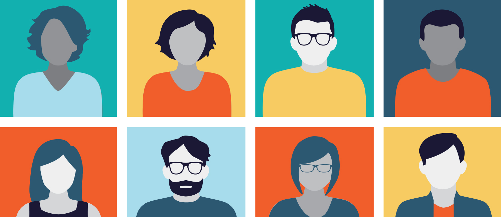

title: "Data Ethics"
author: "Marcello Di Bello"
output:
  rmdformats::html_clean:
    fig_width: 6
    fig_height: 6
    highlight: kate
    thumbnails: true
    lightbox: true
    gallery: true
    toc_depth: 2
    toc: TRUE
---    
    
--->


<!-- 
OTHER INITIAL SETTING PRETTY HTML

---
pagetitle: "Ethics of Data Science"
title: "Data Ethics"
subtitle: ""
author: "Marcello Di Bello"
output:
  prettydoc::html_pretty:
    theme: tactile
    highlight: github
    navbar: yes
    toc: yes
    toc_depth: 3
    toc_float: no
---
-->


<!-- 
---
title: "Data Ethics"
author: "Marcello Di Bello"
output:
  html_document:
    toc: true
    navbar: yes
    toc_depth: 3
    toc_float: yes
    theme: cosmo
  pdf_document:
    toc: false
  highlight: zenburn    
---
--->


<script>
   $(document).ready(function() {
     $head = $('#header');
     $head.prepend('')
   });
</script>


<!---

--->

```{r knitr_init, echo=FALSE, results="asis", cache=FALSE}
library(knitr)
library(rmdformats)
## Global options
options(max.print = "75")
opts_chunk$set(echo = FALSE,
	             cache = FALSE,
               prompt = FALSE,
               tidy = TRUE,
               comment = NA,
               message = FALSE,
               warning = FALSE)
opts_knit$set(width = 75)
```


```{r setup, include=FALSE}
knitr::opts_chunk$set(echo = TRUE)
```


<style type="text/css">

body{ /* Normal  */
      font-size: 20px;
      font-family:'Avenir Next';
  }

</style>


<!--- 
ADDED STYLES/ FONT SIZSES


<style type="text/css">

body{ /* Normal  */
      font-size: 18px;
  }
  
 
td {  /* Table  */
  font-size: 8px;
}
h1.title {
  font-size: 38px;
  color: DarkRed;
}
h1 { /* Header 1 */
  font-size: 28px;
  color: DarkBlue;
}
h2 { /* Header 2 */
    font-size: 22px;
  color: DarkBlue;
}
h3 { /* Header 3 */
  font-size: 18px;
  font-family: "Times New Roman", Times, serif;
  color: DarkBlue;
}
code.r{ /* Code block */
    font-size: 12px;
}
pre { /* Code block - determines code spacing between lines */
    font-size: 14px;
}

</style>
-->


# Course description

The collection, storage and use of data for drawing inferences and making decisions can be tremendously 
beneficial for individuals and societies. But these activities, 
especially when they are automated and on a large scale,also 
raise pressing concerns. What are the 
ethical and political implications 
of data collection and data manipulation? 
What dangers do biased and incomplete data pose? 
Could extensive reliance on data in automated decision-making 
encroach upon our privacy and freedom of choice? Should data be for sale 
or should the marketplace of data be restricted? Could data-driven 
algorithmic decisions entrench inequalities and injustices in society? 
Should algorithmic decisions be explainable to people? 

# Objectives

The aim of the course 
is to instill an appreciation 
for philosophical theorizing and its relavance for 
real world examples. We will examine ethical theories and ethical concepts 
such as utilitarianism, right and wrong, welfare v. fairness, 
equality, privacy and freedom of choice 
in relationship with the collection, storage and use 
of data in large scale. We will also examine different case 
studies as illustrations of the complex interplay 
between ethics and data. 


# Schedule & Readings


## Week 1: Ethics, AI and data

We will start with some general questions 
about the ethics of AI, focusing on the disruptive effect of big 
data and machine learning on public institutions and the lives of individuals. 

- Nick Bostrom and Eliezer Yudkowsky, [The Ethics of Artificial Intelligence](https://nickbostrom.com/ethics/artificial-intelligence.pdf)

-  The White House Office of Science and Technology Policy, [Big Data: A Report on Algorithmic Systems, Opportunity, and Civil Rights](https://obamawhitehouse.archives.gov/sites/default/files/microsites/ostp/2016_0504_data_discrimination.pdf)

Many books have been written on ethics, 
data and AI. Pick one and read it
during the semester, chapter by chapter. 
It will give you a sense of the larger context. 

- Cathy O’Neil, [Weapons of Math Destruction](https://www.amazon.com/Weapons-Math-Destruction-Increases-Inequality/dp/0553418815)

- Virginia Eubanks, 
[Automating Inequality: How High-Tech Tools Profile, Police, and Punish the Poor](https://us.macmillan.com/books/9781250074317) -- [video](https://www.youtube.com/watch?v=Wzssyn0L5I8)

- Ruha Benjamin, [Race After Technology: Abolitionist Tools for the New Jim Code](https://www.amazon.com/Race-After-Technology-Abolitionist-Tools/dp/1509526404)

## Week 2: Data tampering 

Scientists should collect their data and analyze them carefully. They should not tamper, 
invent or select their data so that they fit existing hypotheses. 
This does not always happen, however. [Diederick Stampel](https://en.wikipedia.org/wiki/Diederik_Stapel), a Dutch psychologist, made up a lot of his data. 

> "When the results are just not quite what you’d so badly hoped for; when you know that that hope is based on a thorough analysis of the literature; when this is your third experiment on this subject and the first two worked great; when you know that there are other people doing similar research elsewhere who are getting good results; then, surely, you’re entitled to adjust the results just a little?" Diederik Stapel, ["Faking Science"](https://errorstatistics.files.wordpress.com/2014/12/fakingscience-20141214.pdf)

Even [Gregor Mendel](https://en.wikipedia.org/wiki/Gregor_Mendel), the father of genetics, 
might be guilty of data tampering. According to [Ronald Fisher](https://en.wikipedia.org/wiki/Ronald_Fisher), 
Mendel's data are just too good to be true. 


- *Allan Franklin, [The Mendel-Fisher Controversy](https://www.colorado.edu/physics/sites/default/files/attached-files/mendelfishercontroversy.pdf)

Data tampering might actually be pretty widespread in science today. 

- *Megan L. Head, Luke Holman, Rob Lanfear, Andrew T. Kahn, Michael D. Jennions, 
[The Extent and Consequences of P-Hacking in Science](https://journals.plos.org/plosbiology/article?id=10.1371/journal.pbio.10021060)

- John P. A. Ioannidis, [Why Most Published Research Findings Are False](https://journals.plos.org/plosmedicine/article?id=10.1371/journal.pmed.0020124)


## Week 3: Ethical theories 

Although the case of Mendel is not so clear, what Stapel did seems obviously wrong. 
But why? What principles should we use to distinguish right from wrong, good from bad? 
To answer this question, we will examine 
utilitarianism, one of the most influential ethical theories. Utilitarianism, roughly, 
says that the right action is one that maximizes social welfare overall. 

- Jeremy Bentham, "Introduction to the Principles of Morals and Legislation", 
[Ch. I–II](https://www.econlib.org/library/Bentham/bnthPML.html)

We will also see how utilitarianism holds up against some test cases 
called "trolley problems", imaginary cases in which one is forced to kill the few  in order to save the many. 

- *Judith Thomson, [The Trolley Problem](http://www.psy.vanderbilt.edu/courses/hon182/thomsontrolley.pdf)

- Vsauce, [The Greater Good](https://www.youtube.com/watch?v=1sl5KJ69qiA)

While trolley problems are thought experiments, seemingly removed from real life, 
the moral dilemma that they raise is real. Self-driving cars and shortages of medical supplies 
during the COVID-19 outbreak are realistic examples of trolley problems.

-  Quartz, [Philosophers are building ethical algorithms to help control self-driving cars](https://qz.com/1204395/self-driving-cars-trolley-problem-philosophers-are-building-ethical-algorithms-to-solve-the-problem/)

- The Atlantic, [The Extraordinary Decisions Facing Italian Doctors]( https://www.theatlantic.com/ideas/archive/2020/03/who-gets-hospital-bed/607807/)


## Week 4: Data and decisions

We often hear: evidence-based medicine, evidence-based policing, 
evidence-based teaching, evidence-based policy, etc. 
Data are abundant today. Though incomplete and never truly conclusive, data 
should guide our decisions, often saving lives. 
The case of [Florence Nightingale](https://en.wikipedia.org/wiki/Florence_Nightingale), 
nurse and statistician, is emblematic.

- Eileen Magnello, [Florence Nightingale: The compassionate statistician](https://plus.maths.org/content/florence-nightingale-compassionate-statistician)

Data are playing a key role in the responses to 
the COVID-19 global pandemic. 

- Max Roser, Hannah Ritchie and Esteban Ortiz-Ospina, 
[Coronavirus Disease (COVID-19) - Statistics and Research](https://ourworldindata.org/coronavirus)


- Tomas Pueyo, [Coronavirus: Why You Must Act Now"](https://medium.com/@tomaspueyo/coronavirus-act-today-or-people-will-die-f4d3d9cd99ca)


- Left, [Covid_19: Open letter from Italy to the international scientific community](https://left.it/2020/03/13/covid_19-open-letter-from-italy-to-the-international-scientific-community/?fbclid=IwAR0YbnRWpw0rzCFIb289bB74u6NkLs6tQeZN7JP4wAjv3wgWdOvB-chk7g4)


## Week 5: Biased and missing data

Data are helpful to make 
decisions, but what if they are biased, partial or incomplete? 

- *Joy Buolamwini, [Algorithms Aren’t Racist. Your Skin Is just too Dark](https://hackernoon.com/algorithms-arent-racist-your-skin-is-just-too-dark-4ed31a7304b8)

- *Moritz Hardt, [How Big Data Is Unfair](https://medium.com/@mrtz/how-big-data-is-unfair-9aa544d739de)

- *[Technical Flaws of Pretrial Risk Assessments Raise Grave Concerns](https://cyber.harvard.edu/story/2019-07/technical-flaws-pretrial-risk-assessments-raise-grave-concerns)

Wouldn't data-based decisions magnify 
errors on a large scale especially when they are
automated? Garbage in, garbage everywhere.

- Danielle Ensign, Sorelle A. Friedler, Scott Neville, Carlos Scheidegger, and Suresh Venkata. [Runaway feedback loops in predictive policing](https://arxiv.org/abs/1706.09847) -- [video](https://www.youtube.com/watch?v=Qj_t8DL5TeQ)


**First graded assignment (high stake) due**

## Week 6: The marketplace of data

Data is a lucrative business. But not everythign should 
be for sale, or at least this is what 
some philosohers have argued.

- Debra Satz, [Why Some Things Should Not Be for Sale: The Moral Limits of Markets](https://www.oxfordscholarship.com/view/10.1093/acprof:oso/9780195311594.001.0001/acprof-9780195311594) -- focus on the introdocution and read one chapter of your choice from PART III.

The Facebook/Cambridge 
Analytica scandal 
is an example. 

- Wired, [How Cambridge Analytica Sparked the Great Privacy Awakening](https://www.wired.com/story/cambridge-analytica-facebook-privacy-awakening/)

Should all data be for sale or should their market be regulated? If so, how? 
What ethical principles should be followed?


## Week 7: Privacy

Collection of large amounts of data is a threat to our privacy.  Curiously, however, many today showcase their lives  through social media. We are living in an "expository society".

- Bernard Harcourt, [Exposed](https://www.hup.harvard.edu/catalog.php?isbn=9780674504578&content=reviews) -- focus on the introduction

There may be different reason why privacy is important, say, protecting ourselves 
against harms resulting from others using data about ourselves, 
retaining control over our bodies and possessions, or an interest 
in controlling how we are perceived by others.

- *Judith Thomson, "The Right to Privacy"

- *Andrei Marmor, ["What Is the Right to Privacy?"](https://cpb-us-e1.wpmucdn.com/blogs.cornell.edu/dist/5/5699/files/2015/07/papa-privacy-12040-tjqod4.pdf)

Legilsation has been put in place to 
protect and regulate data, such as the European 
Union GDPR. 

- European Union, [General Data Protectio Regulation (GDPR)](https://gdpr.eu/what-is-gdpr/)

Is the GDPR a step in the right direction? What guiding ethical principles should be followed?

David J. Hand, [Aspects of Data Ethics in a Changing World: Where Are We Now?](https://www.ncbi.nlm.nih.gov/pmc/articles/PMC6154451/pdf/big.2018.0083.pdf)

## Week 8: Nudging freedom 

We value our freedom of choice. It is an essential 
part of democratic societies. 

- John Stuart Mill, [On Liberty](https://www.utilitarianism.com/ol/one.html) -- focus on Ch. 1, 3, 4, 5.

- T.M. Scanlon, [The Significance of Choice](https://tannerlectures.utah.edu/_documents/a-to-z/s/scanlon88.pdf)

But technology is putting a strain on our 
deliberative processes, influencing our 
minds and preferences in ways 
we might not be aware of. 

- Holly B. Shakya and Nicholas A. Christakis, [Association of Facebook Use With Compromised Well-Being: A Longitudinal Study](https://www.ncbi.nlm.nih.gov/pubmed/28093386)
-  Tristan Harris, [Tech Companies Design Your Life, Here’s Why You Should Care](https://medium.com/thrive-global/tech-companies-design-your-life-here-s-why-you-should-care-e962f412cc81)

Should we be worried about what is sometimes 
called "nudging"?  Couldn't this a way to force people to 
make better decisions for themselves and society?

-  Cass Sunstein and Richard Thaler, [Nudge](https://yalebooks.yale.edu/book/9780300122237/nudge) -- focus 
on the introduction

And what about the more comprehensive China's social score system?

- Wired, [How the West Got China's Social Credit System Wrong](https://www.wired.com/story/china-social-credit-score-system/)


## Week 9: Algorithmic fairness

Data-based predictive and scoring 
algorithms are now everywhere. They are used by private and public sector entities: banks, social workers,
police, judges, etc. While algorithms are efficient and usable in large scale, are they 
going to treat people fairly? ProPublica argued that [COMPAS](https://en.wikipedia.org/wiki/COMPAS_(software)) -- a predictive algorithm used in criminal justice 
to help judges make decisions about bail, preventative detention and sentencing -- was biased against 
black defendants. 

- ProPublica, [Machine Bias: There's software used across the country to predict future criminals. And it’s biased against blacks.](https://www.propublica.org/article/machine-bias-risk-assessments-in-criminal-sentencing)

Northpointe, the company that designed COMPAS, rejected the accusation. 

- William Dieterich, Christina Mendoza, and Tim Brennan. [COMPAS risk scales: Demonstrating accuracy equity and predictive parity performance of the COMPAS risk scales in Broward county](https://go.volarisgroup.com/rs/430-MBX-989/images/ProPublica_Commentary_Final_070616.pdf) 


What does it mean for algorithms to be fair in the first place?

- *Deborah Hellman, [Measuring Algorithmic Fairness](https://papers.ssrn.com/sol3/papers.cfm?abstract_id=3418528)

## Week 10: Explanability 

It's a problem if algorithms make mistakes or treat people unfairly. It's also a problem if algorithmic 
decision-making is a "black box".  Suppose an algorithm denied you a loan but gave no explanation for the decision. 
Should algorithms explain their decisions? What is the ethical value of an explanation? 

*Solon Barocas and Andrew Selbst, [The Intuitive Appeal of Explainable Machines](https://papers.ssrn.com/sol3/papers.cfm?abstract_id=3126971)


**Second graded assignment (high stake) due**


# Assignments

## Pass/fail assignments (*low stake*)

Every week please write a **one-page précis** of one of the papers assigned for that week
and marked with an asterisk. The précis should describe: (a) topic of the paper; 
(b) main thesis (or main theses, if there are more than one); 
(c) supporting arguments; (d) objections to these arguments, complications or 
difficulties that the author considers (if any).


## Graded assignments (*high stake*)

There will be two main graded assignments 
for this course, roughly **10 pages** each. 
The **first** will cover Week 1 through 5, the 
**second**  Week 6 through 10.

**1**. (a) Pick a dataset and describe it carefully with a few summary statistics. 
(b) Think about how the data could be used for research and what kinds of inferences could be drawn.
(c) Look on-line to see whether the data have already been used by researchers, and if so, how. 
(d) Reflect on how these data could benefit individuals or public and private institutions. 
(e) Reflect on the actual or potential misuses of the data. Keep in mind the ethical theories discussed in class as well as the ethical challenges discussed in class such as data tampering, biased and missing data. Roughly **10 pages**. You can pick any dataset from a reputable source which you feel comfortable working with, for example, look at the ProPublica datasets on [Criminal justice](https://www.propublica.org/datastore/datasets/criminal-justice),
[Health](https://www.propublica.org/datastore/datasets/health) and 
[Politics](https://www.propublica.org/datastore/datasets/health)

**2**. Think about the debate on algorithmic fairness. Write a philosophical argumentative essay 
addressing the following points. (a) The debate between ProPublica and Northpointe on COMPAS. (b) What does this debate tell us about different conceptions of algorithmic fairness? (c) What are utilitarian/consequentialist reasons to downplay 
the importance of fairness? (d) How could an egalitarian respond? (e) Where do you stand on the disagreement between utilitarians and egalitarians about algorithmic fairness? Roughly **10 pages**. Please always defend the claims you make with careful and reasoned arguments. Check out these [guidelines](http://www.jimpryor.net/teaching/guidelines/writing.html)
on how to write a philosophical argumentative essay 

# Other data ethics courses 

- Niko Kolodny's [Moral Questions of Data Science](https://bcourses.berkeley.edu/courses/1477033) - UC, Berkeley

- Suresh Venkatasubramanian's [Ethics in Data Science](https://utah.instructure.com/courses/462398/assignments/syllabus) - University of Utah

- Elisa Celis's [Data Sciece Ethics](https://datascienceethics.org/the-course/syllabus/)

- Solon Barocas's [Ethics and Policy in Data Science](https://docs.google.com/document/d/1GV97qqvjQNvyM2I01vuRaAwHe9pQAZ9pbP7KkKveg1o/edit) - Cornell

# Other topics


## Opinion polarization

Most of the information we consume is through social media which 
track what we read, watch and enjoy. We are then 
fed more and more information that aligns with our viewpoints, creating a massive 
"echo chamber". The internet is making it harder to hear viewpoints different from our own. 
This is, presumably, one of the driving causes of opinion polarization.

- Cass Sunstein, [#Republic: Divided Democracy in the Age of Social Media](https://press.princeton.edu/books/hardcover/9780691175515/republic) -- focus on Chapter 1

There might be, of coruse, other reasons for opinion polarization, having to do with the compex and fragmentary nature of the evidence and information we have available.

- Kevin Dorst, [Why Rational People Polarize](https://phenomenalworld.org/analysis/why-rational-people-polarize)
